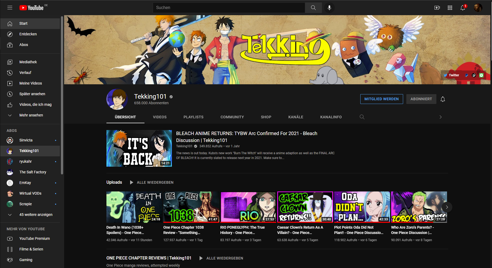

# Youtube-clone

## Task
---
Building a static youtube channel page clone
### My reference: 

### To do

- [x] Structure the Page Content in HTML
- [x] Use Flex on Header and Sidebar
- [x] Use Grid on the Video Display Container
- [ ] Find the right propterties for styling the elements

### Blog 

First i build the general containers for the Main Content elements like Header, Sidebar and Channelcontent

Next i build the subcontainers for each element to get an basic idea of the Structure used on youtube. I started to inspect the elements on the original.

After that i started to style the first elements bringing everything into a rough shape using flexbox and grid.

Then i started the coloring process. And added some images to have some feeling of progress.

